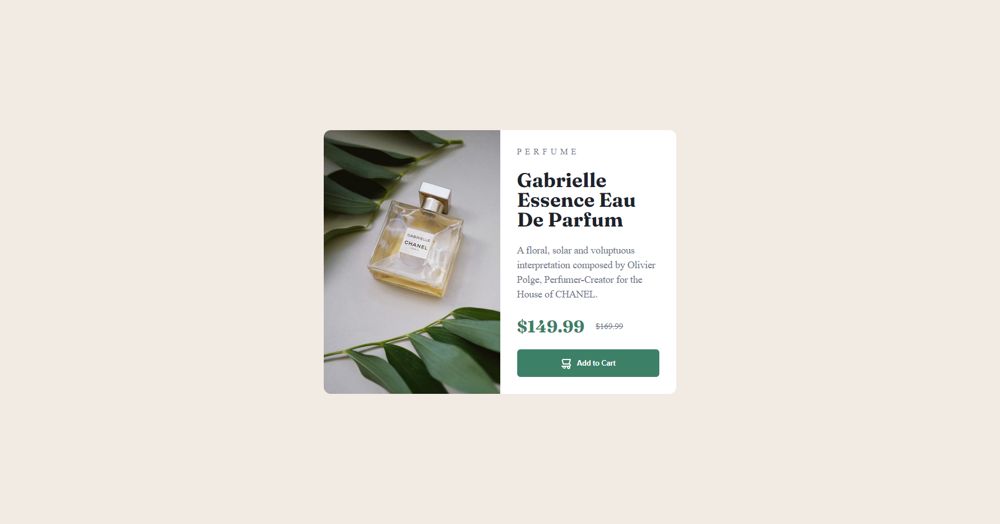

# Frontend Mentor - Product preview card component solution

This is a solution to the [Product preview card component challenge on Frontend Mentor](https://www.frontendmentor.io/challenges/product-preview-card-component-GO7UmttRfa). Frontend Mentor challenges help you improve your coding skills by building realistic projects.

## Table of contents

  - [The challenge](#the-challenge)
  - [Screenshot](#screenshot)
  - [Links](#links)
- [My process](#my-process)
  - [Built with](#built-with)
  - [What I learned](#what-i-learned)
  - [Continued development](#continued-development)
  - [Useful resources](#useful-resources)
- [Author](#author)
- [Acknowledgments](#acknowledgments)

### The challenge

Users should be able to:

- View the optimal layout depending on their device's screen size
- See hover and focus states for interactive elements

### Screenshot

### Links

- Solution URL: [https://github.com/monicaivanov/roduct-Preview-Card-Component.git]
- Live Site URL: [https://monicaivanov.github.io/Product-Preview-Card-Component/]

## My process

I start with HTML structure taking into consideration the desktop view structure. I continue with CSS - reset and custom properties, followed by mobile structure and desktop structure. I finish with CSS styling.

### Built with

- Semantic HTML5 markup
- CSS custom properties
- Flexbox
- CSS Grid
- Mobile-first workflow

### What I learned

html: 
picture element, srcset attribute;

css:
building equal columns with flexbox.

### Continued development

Learning flexbox and grid. 

### Useful resources

- [Kevin Powell video tutorials](https://www.youtube.com/watch?v=u044iM9xsWU&t=435s) - High quality resources with practical application.

## Author

- Frontend Mentor - [@monicaivanov](https://www.frontendmentor.io/profile/monicaivanov)

## Acknowledgments

One step at a time I continue to grow. I am very proud of myself.
